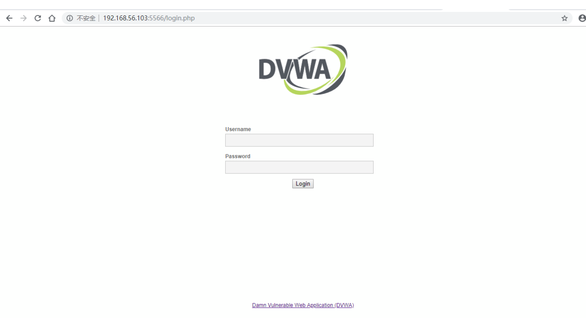
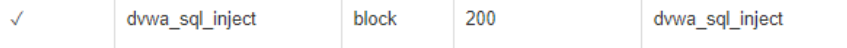
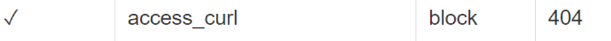

# 第五章：Web服务器（实验）

### 实验环境

- Ubuntu 18.04.4 Server 64bit
- PuTTY 64bit
- nginx version: nginx/1.14.0 (Ubuntu)
- VeryNginx
- wordpress-4.7
- DVWA


### 软件环境建议

* [Nginx](http://nginx.org/)
* [VeryNginx](https://github.com/alexazhou/VeryNginx)
* [Wordpress](https://wordpress.org/)
    * [WordPress 4.7](https://wordpress.org/wordpress-4.7.zip) | [备用下载地址](https://github.com/WordPress/WordPress/archive/4.7.zip)
* [Damn Vulnerable Web Application (DVWA)](http://www.dvwa.co.uk/)
  
-------

# 实验配置

#### 安装配置Verynginx、Nginx、Wordpress、DVWA
#### 更改Windows主机hosts文件
```bash
# Web Server
192.168.90.102 vn.sec.cuc.edu.cn
192.168.90.102 dvwa.sec.cuc.edu.cn
192.168.90.102 wp.sec.cuc.edu.cn
```
#### Nginx
- 安装nginx
  ```bash
  sudo apt install nginx
  ```
- 安装mysql数据库和安全脚本

  ```bash
  sudo apt install mysql-server
  sudo mysql_secure_installation
  ```

- 安装php

  ```bash
  sudo apt install php-fpm php-mysql
  ```

#### VeryNginx
- 克隆verynginx的仓库至虚拟机中，然后进入仓库目录，运行安装语句。

  ```bash
  # 安装一些库和依赖
  sudo apt-get install libpcre3-dev libssl1.0-dev zlib1g-dev build-essential
  # 克隆VeryNginx仓库
  git clone https://github.com/alexazhou/VeryNginx.git
  cd VeryNginx
  sudo python3 install.py install
  ```
- 修改 `/opt/verynginx/openresty/nginx/conf/nginx.conf` 配置文件

  ```bash
  sudo vim /opt/verynginx/openresty/nginx/conf/nginx.conf
  # 将user从nginx修改为www-data
  # 修改server监听端口为8080
  ```

- 启动verynginx，通过浏览器对verynginx进行配置，在浏览器中访问`http://192.168.208.3:8080/verynginx/index.html` 默认用户名和密码 `verynginx` / `verynginx`。登录后可进行相关配置。
  


###  wordpress

- 下载mysql、php和相关扩展

        # 安装数据库
        $ sudo apt install mysql-server
        # 检查是否正常运行，默认下无密码
        $ sudo mysql -u root -p

        #安装php和相关扩展
        $ sudo apt install php-fpm php-mysql
        $ sudo apt install php-curl php-gd php-intl php-mbstring php-soap php-xml php-xmlrpc php-zip
        $ sudo systemctl restart php7.2-fpm

- 创建 wordpress 需要数据库支持

        # mysql新建数据库
        $ sudo mysql -u root -p
        > CREATE DATABASE wordpress DEFAULT CHARACTER SET utf8 COLLATE utf8_unicode_ci;
        > GRANT ALL ON wordpress.* TO 'wpuser'@'localhost' IDENTIFIED BY 'test';
        > FLUSH PRIVILEGES;
        > EXIT;

- 下载 wordpress

        $ cd /tmp

        # 下载实验指定版本安装包
        $ sudo wget https://wordpress.org/wordpress-4.7.zip

        # 解压
        $ unzip wordpress-4.7.zip

        # 移动文件夹到指定目录
        $ cp /tmp/wordpress/wp-config-sample.php /tmp/wordpress/wp-config.php
        $ sudo cp -a /tmp/wordpress/. /var/www/wordpress

        # 修改文件夹属主为 www-data
        $ sudo chown -R www-data:www-data /var/www/wordpress

- 修改 wordpress 相关配置文件

        $ curl -s https://api.wordpress.org/secret-key/1.1/salt/
        $ sudo vim /var/www/html/wordpress/wp-config.php

                # 修改内容如下
                # 修改相关参数
                define('DB_NAME', 'wordpress');

                /** MySQL database username */
                define('DB_USER', 'wpuser');

                /** MySQL database password */
                define('DB_PASSWORD', 'test');

                # 新增相关内容
                define('FS_METHOD', 'direct');
        
        $ sudo vim /etc/nginx/sites-available/default

                # 增加内容
                location ~ \.php$ {
                    include snippets/fastcgi-php.conf;
                    fastcgi_pass unix:/var/run/php/php7.2-fpm.sock;
                    }
                
                # 修改网站根站点
                root /var/www/html/wordpress;
                # 修改监听端口
                listen 8888;
                # 修改server_name
                wp.sec.cuc.edu.cn

        
        # 语法检查
        $ sudo nginx -t

        # 重启nginx
        $ sudo systemctl restart nginx
    

### 安装 dvwa

- 下载安装包

        $ cd /tmp
        $ git clone https://github.com/ethicalhack3r/DVWA
        $ sudo mv /tmp/DVWA /var/www/html

- dvwa需要数据库支持，所以先新建数据库

        $ sudo mysql -u root -p

        > CREATE DATABASE dvwa DEFAULT CHARACTER SET utf8mb4 COLLATE utf8mb4_unicode_ci;
        > GRANT ALL ON dvwa.* TO 'dvwauser'@'localhost' IDENTIFIED BY 'test';
        > FLUSH PRIVILEGES;
        > EXIT;

        $ sudo systemctl restart mysql

- 修改dvwa数据库相关和其他设置

        $ cd /var/www/html/DVWA
        $ cp config/config.inc.php.dist config/config.inc.php
        $ sudo vim /var/www/html/DVWA/config/config.inc.php 
                
                # 修改以下内容
                $_DVWA[ 'db_database' ] = 'dvwa';
                $_DVWA[ 'db_user' ]     = 'dvwauser';
                $_DVWA[ 'db_password' ] = 'test';
        
        # 修改文件属主
        $ sudo chown -R www-data:www-data /var/www/html/DVWA

        # 修改 nginx 相关配置
        $ sudo vim /etc/nginx/sites-available/default

                server {
                        listen 5566;
                        server_name  dvwa.sec.cuc.edu.cn;

                        root /var/www/html/DVWA;
                        index index.html index.htm index.php index.nginx-debian.html;

                        location / {
                                try_files $uri $uri/ = 404;
                                }

                        location ~ \.php$ {
                                include snippets/fastcgi-php.conf;
                                fastcgi_pass unix:/var/run/php/php7.2-fpm.sock;
                                }
                                }

        # 修改php相关设置
        $ sudo vim  /etc/php/7.2/fpm/php.ini

                # 修改以下内容
                allow_url_include = On
                display_errors = off
        
        # 重启php，使配置生效
        $ sudo systemctl restart php7.2-fpm

        $ 重启nginx，使配置生效
        $ sudo systemctl restart nginx

-----
## 实验检查点


### 基本要求

* 在一台主机（虚拟机）上同时配置[Nginx](http://nginx.org/)和[VeryNginx](https://github.com/alexazhou/VeryNginx)
    * VeryNginx作为本次实验的Web App的反向代理服务器和WAF
    * PHP-FPM进程的反向代理配置在nginx服务器上，VeryNginx服务器不直接配置Web站点服务
* 使用[Wordpress](https://wordpress.org/)搭建的站点对外提供访问的地址为： http://wp.sec.cuc.edu.cn 
* 使用[Damn Vulnerable Web Application (DVWA)](http://www.dvwa.co.uk/)搭建的站点对外提供访问的地址为： http://dvwa.sec.cuc.edu.cn
##### 设置 VeryNginx 实现端口转发
- 通过 `VeryNginx` 进行相关设置
- 配置`wp.sec.cuc.edu.cn`和`dvwa.sec.cuc.edu.cn`
  * 添加matcher
  
  * 添加Up Stream节点以及添加代理通行证
   
  
---

### 安全加固要求

* 使用IP地址方式均无法访问上述任意站点，并向访客展示自定义的**友好错误提示信息页面-1**
    - 添加matcher
     
    - 添加自定义response
     
    - 添加filter
     
  
  
* [Damn Vulnerable Web Application (DVWA)](http://www.dvwa.co.uk/)只允许白名单上的访客来源IP，其他来源的IP访问均向访客展示自定义的**友好错误提示信息页面-2**
  * 修改 Matcher
  
  * 修改 Response
  
  * 修改 Filter
  
  * 效果
  

* 在不升级Wordpress版本的情况下，通过定制[VeryNginx](https://github.com/alexazhou/VeryNginx)的访问控制策略规则，**热**修复[WordPress \< 4.7.1 - Username Enumeration](https://www.exploit-db.com/exploits/41497/)
  - 通过阅读资料，我们可以知道这个漏洞是通过访问了特定的URI（ wp-json/wp/v2/users/ ）实现的，所以我们需要做的就是禁止去访问它即可

   - 修改 Matcher
     
   - 修改 Response
     
   - 修改 Filter
     
   - 修改前后的效果对比
     
     
* 通过配置[VeryNginx](https://github.com/alexazhou/VeryNginx)的Filter规则实现对[Damn Vulnerable Web Application (DVWA)](http://www.dvwa.co.uk/)的SQL注入实验在低安全等级条件下进行防护
  -  防护规则：针对 SQL 注入常用关键词进行防护
  - 修改 Matcher
    
  - 修改 Response
    
  - 修改 Filter
    
  - 实验效果
    
---

## VeryNginx配置要求

* [VeryNginx](https://github.com/alexazhou/VeryNginx)的Web管理页面仅允许白名单上的访客来源IP，其他来源的IP访问均向访客展示自定义的**友好错误提示信息页面-3**

  - 添加matcher
    
  - 添加自定义response
    
  - 添加filter
    
  - 实验结果
    
* 通过定制[VeryNginx](https://github.com/alexazhou/VeryNginx)的访问控制策略规则实现：
    * 限制DVWA站点的单IP访问速率为每秒请求数 < 50
    * 限制Wordpress站点的单IP访问速率为每秒请求数 < 20
    * 超过访问频率限制的请求直接返回自定义**错误提示信息页面-4**

   - 修改 Response
     
   - 修改 Frequency Limit
     
   - 实验结果
     

* 禁止curl访问
   - 添加matcher
     
   - 添加filter
     

  
#### Q&S
1. Nginx 版本问题，先前参考官网教程时，下载了成了 Mainline version 版本，导致后面实验找不到对应的文件目录。后来重新下载了正确的版本
2. 一开始打不开网站因为没有在hosts文件里面加入ip地址
3. mysql：`ERROR 1819 (HY000): Your password does not satisfy the current policy requirements`
   - 解决：安装的时候不设置密码更简单
   - 查看初始密码策略：`SHOW VARIABLES LIKE 'validate_password%';`
   - 自定义密码强度为低：`set global validate_password_policy=LOW;`
   - 自定义密码长度为4：`set global validate_password_length=4;`


### 参考资料
- [alexazhou/VeryNginx官方文档](https://github.com/alexazhou/VeryNginx/blob/master/readme_zh.md)
- [How To Install Linux, Nginx, MySQL, PHP (LEMP stack) on Ubuntu 18.04](https://www.digitalocean.com/community/tutorials/how-to-install-linux-nginx-mysql-php-lemp-stack-ubuntu-18-04)
- [How To Install WordPress with LEMP on Ubuntu 18.04](https://www.digitalocean.com/community/tutorials/how-to-install-wordpress-with-lemp-on-ubuntu-18-04)
- [How to Install and Configure DVWA Lab on Ubuntu 18.04 server](https://kifarunix.com/how-to-setup-damn-vulnerable-web-app-lab-on-ubuntu-18-04-server/)
- https://github.com/c4pr1c3/LinuxSysAdmin/blob/master/chap0x05.exp.md